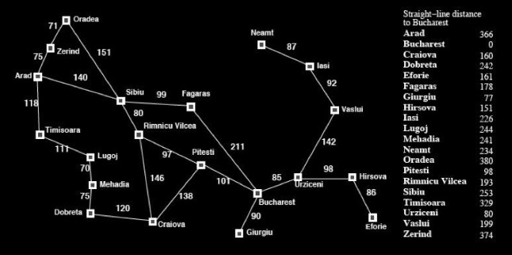

# 1. Finding shortest path using A* search algorithm

## 2. In this code I have used A* algorithm to find the shortest path between the start node and the end node

### 3. What I have used to implement the A* algorithm

    - Priority Queue
    - Dictionary containing Heuristic values

### 4.0 Problem Description

#### 4.1 Romania with step costs in km

-On holiday, a flight  currently wants to travel to __Bucharest__ from __Arad__. But there is no direct way to Bucharest from Arad. However, the cities are connected with each other like a graph. The distance between the connected cities are given. The flight wants to travel through the most optimal way. To find the optimal path to travel, another information is provided: the straight line distance between any city and the final destination (Bucharest).

Now apply __A*__ search to determine the most optimal value for the route __Arad__ to __Bucharest__ and help the flight. You have to use the straight line distance as the heuristic value for the cities.

##### 4.2 Heuristic values

| City      | Heuristic value | City      | Heuristic value |
| ----------- | ----------- | ----------- | ----------- |
|Arad|366|Mehadia|241
|Bucharest|0|Neamt|234
|Craiova|160|Oradea|380
|Eforie|161|Pitesti|100
|Fagaras|176|Rimnicu Vilcea|193
|Dobreta|242|Timisoara|329
|Hirsova|151|Urziceni|80
|lasi|226|Vaslui|199
|Lugoj|244|Zerind|374

##### 4.3 INPUTS

Your txt file should take each node followed by each destination it can reach and their corresponding distance and heuristics. You are to read the file then ask the user to input the starting and the destination point.

##### 4.4 OUTPUTS

The output will contain the total distance from the starting point to the destination followed by printing the nodes it followed to calculate the distance.

##### 4.5 SAMPLE INPUT

In the text file:

Arad 366 Zerind 75 Sibiu 140 Timisoara 118
Zerind 374 Arad 75 Oradea 71
Oradea 380 Zerind 71 Sibiu 151
... ... ... ... ... ...
Bucharest 0 Pitesti 101 Fagaras 211 Giurgiu 90 Urziceni 85
Giurgiu 77 Bucharest 90
... ... ... ... ... …

The text file is arranged as follows:

Each line starts with a node followed by the heuristic of that node
Then the neighboring nodes and the distance from the parent node is given as a pair
All neighboring city-distance pairs are listed after the heuristic.

For example, the text file starts with Arad which has a heuristic of 366. It is the parent node to Zerind, Sibiu and Timisoara which are 75, 140 and 118 km away from Arad. Notice that since Bucharest is the End node which is why it has a heuristic of 0.

##### 4.6 SAMPLE OUTPUT

Path: Arad -> Sibiu -> Rimnicu -> Pitesti -> Bucharest
Total distance: 418 km
